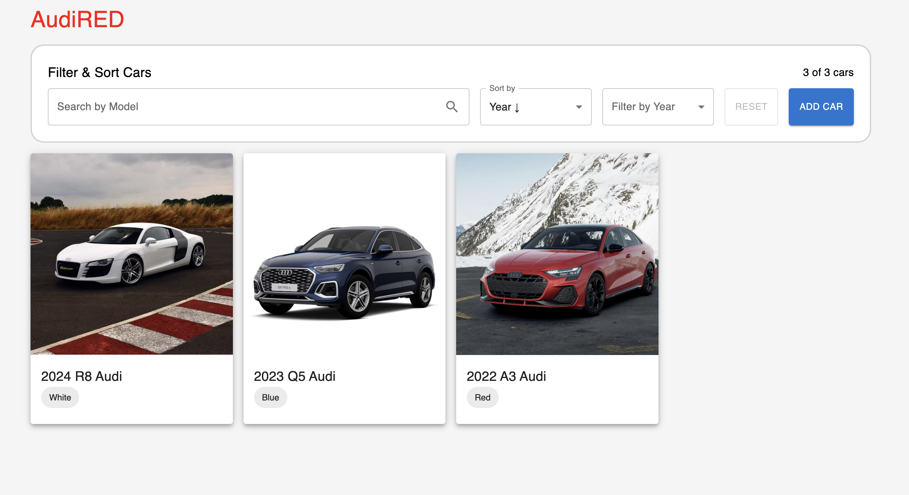
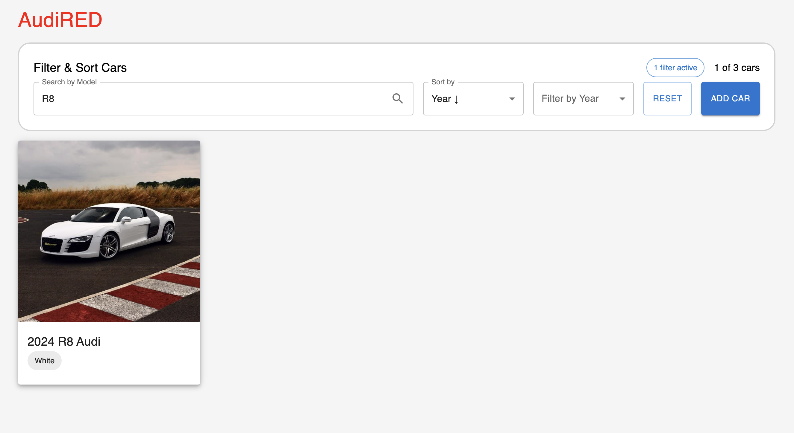

# BIMM Assessment
This project is a take home assessment for BIMM.

## Setup Instructions

1.  **Prerequisites:**
    *   Ensure you have [Node.js](https://nodejs.org/) installed (which includes npm).
    *   Ensure you have [pnpm](https://pnpm.io/installation) installed. You can install it via npm if you haven't already: `npm install -g pnpm`.
    *   Clone the repository to your local machine.
    *   Navigate into the project's root directory: `cd path/to/bimm-assessment`.

2.  **Install Dependencies:**
    *   In the root of the `bimm-assessment` directory, run the following command to install all necessary packages.
    
        ```bash
        pnpm install
        ```

## How to Run

* Open a terminal window/tab.
* Navigate to the root of the project directory"
  ```bash
  cd /path/to/bimm-assessment
  ```
* Execute the command: To run the application
  ```bash
  pnpm run dev
  ```
* The vite development server will start. Observe the terminal output for the port number it is running on (e.g. http://localhost:3000)

## Project Overview

### Directory Structure

This directory structure is based on [bulletproof-react](https://github.com/alan2207/bulletproof-react/) repo. 
Each feature folder contains code specific to the feature, keeping things neat and separate.

I scoped this feature under `cars/` to remain consistent with the assessment’s API naming (e.g., `useCars`, `GetCars`). In a real-world project, I’d consider using a domain abstraction like `vehicles/` if we anticipated supporting multiple vehicle types in the future.

Queries and mutations are organized as one file per operation within each feature’s `api/` folder. This pattern improves scalability, tree-shaking, and mockability as the app grows. In a larger codebase, I’d also separate `queries/` and `mutations/` folders under `api/`.

```
src/
│
├── app/                    # Route definitions and global layouts
│   └── index.tsx           # main application component    
|   ├── provider.tsx        # application provider that wraps the entire application with different global providers - this might also differ based on meta framework used
|   ├── router.tsx          # application router configuration
|   ├── routes              # application routes / can also be pages
├── features/               # Feature-based grouping
│   └── cars/
│       ├── components/
│       ├── pages/
│       ├── hooks/
│       ├── api/
│       ├── types/
│       ├── constants/
│       ├── utils/
│   └── tasks/
│       ├── components/
│
├── components/             # Reusable UI components
│   └── ui/                 # Low-level UI (e.g., Button, Modal)
├── pages/                  # Components mapped to routes
├── lib/                    # Utility functions, third-party wrappers
├── hooks/                  # Shared hooks not tied to features
├── types/                  # Global TypeScript types
├── utils/                  # Global utility functions
├── providers/              # React context providers
├── assets/                 # Images, icons, fonts
└── test/                   # Testing utilities and mocks
```

### Tech Stack

- **React** with **TypeScript** — modern, type-safe frontend framework
- **Apollo Client** — GraphQL client for data fetching and caching
- **Material UI (MUI)** — Component library for consistent styling
- **Vite** — Fast dev server and bundler
- **MSW (Mock Service Worker)** — For mocking GraphQL APIs in local dev
- **Jest + React Testing Library** — For unit and integration tests

## Features

-  Car list display using GraphQL (GetCars query)
-  Search, sort, and year filter
-  Add new car with form
-  Server-side filtering with debounced search
-  Reusable shared components (Button, Card, Dialog, etc.)
-  Unit tests with RTL + MSW

## Running Tests

To run the unit tests:

```bash
pnpm test
```

## Demo

